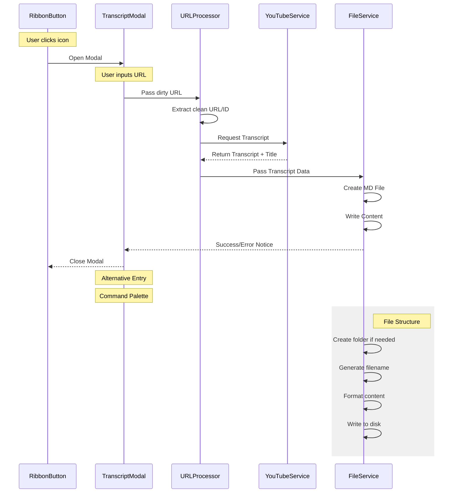

# YouTube Transcript Plugin for Obsidian 0.0.0


## Project Structure
```
src/
├── ui/
│   ├── RibbonButton.ts         # Ribbon UI component
│   └── TranscriptModal.ts       # Modal UI component
├── services/
│   ├── URLProcessor.ts          # URL cleaning and validation
│   ├── YouTubeService.ts        # Transcript fetching*
│   └── FileService.ts           # File operations
├── types/
│   └── index.ts                # Type definitions
└── main.ts                     # Plugin entry point
```

## Components

### 0. RibbonButton (UI Layer) - done
**Responsibility**: Quick access trigger in Obsidian's left ribbon
- Creates ribbon button with `message-square-share` icon
- Triggers TranscriptModal on click
- Handles button state/visibility
- Returns: `void`


### 1. TranscriptModal (UI Layer) - done
**Responsibility**: User interaction and input collection
- Shows input field for YouTube URL
- Handles user submission
- Displays success/error messages
- Returns: `string` (dirty URL)

### 2. URLProcessor (Service Layer) - done
**Responsibility**: URL processing and validation
- Cleans and validates YouTube URLs
- Extracts video IDs
- Input: `string` (dirty URL)
- Returns: `string` (clean URL)

### 3. YouTubeService (Service Layer) - done
**Responsibility**: Transcript retrieval
- Handles YouTube API interaction
- Fetches transcripts
- Input: `string` (clean URL)
- Returns: `string` (transcript text)

### 4. FileService (Service Layer) - done
**Responsibility**: File operations
- Creates markdown files
- Writes content
- Handles file naming
- Input: `string` (transcript), `string` (title)
- Returns: `void`

## Data Flow
1. User enters URL in modal
2. URL is processed and cleaned
3. Clean URL used to fetch transcript
4. New file created with video title
5. Transcript written to file
6. Success/error message shown to user

## Types
```typescript
interface RibbonButtonOptions {
    icon: string;        // 'message-square-share'
    tooltip: string;     // Button hover text
    onClick: () => void; // Modal trigger function
}

interface TranscriptResult {
    text: string;
    title: string;
    url: string;
    timestamp: Date;
}

interface FileCreationOptions {
    title: string;
    content: string;
    folder?: string;
    timestamp: Date;
}
```

## Error Handling
- URL validation errors
- YouTube API errors
- File system errors
- Network errors

## Future Enhancements
- Custom folder selection
- Transcript formatting options
- Multiple video processing
- Progress indicators
- Settings management




```
After analyzing the codebase, I can now describe the data flows in this Obsidian plugin application. Let me use attempt_completion to provide a comprehensive overview of the data flows.

Task Completed

The application is an Obsidian plugin with the following key data flows:

1. User Interface Flow:
    
    - Entry point is through two ribbon buttons in the Obsidian interface:
        - Main transcript button (RibbonButton)
        - File handling button (FileRibbonButton)
    - When clicked, the main button opens a TranscriptModal for URL input
2. URL Processing Flow:
    
    - Raw URL (dirtyURL) → URLProcessor
    - URLProcessor performs:
        - URL cleaning and whitespace removal
        - Video ID extraction using multiple YouTube URL format patterns
        - URL validation and standardization to format: https://www.youtube.com/watch?v={videoId}
        - Fetches video metadata using the page HTML
3. YouTube Service Flow:
    
    - Clean URL → YouTubeService
    - YouTubeService fetches the transcript from YouTube
    - Returns transcript data back to the main flow
4. File Management Flow:
    
    - FileService handles file operations with the following data path:
        - Receives video title, URL, and transcript
        - Sanitizes the title for valid filename
        - Creates a markdown file with frontmatter (URL and creation date)
        - Handles filename conflicts by appending numbers
        - Stores the file in the Obsidian vault
5. Error Handling Flow:
    
    - Errors from any service are caught and displayed to user via Obsidian Notice
    - Error logging to console for debugging

The overall data pipeline is: User Input → URL Processing → YouTube Data Fetch → File Creation → Obsidian Storage

Each step includes validation and error handling, with user feedback through the Obsidian Notice system and console logging for debugging purposes.
```
